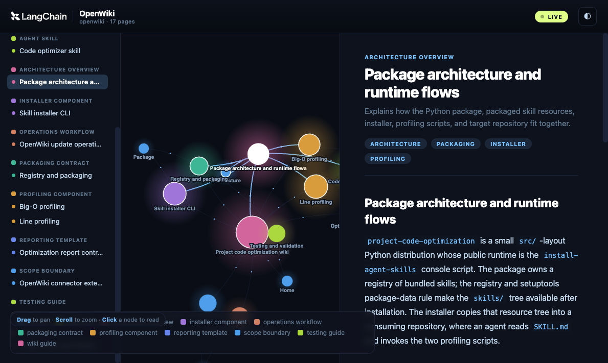

# project-code-optimization

Enterprise-grade Agent Skills package for automated Python Big-O profiling,
line-by-line operation-hit profiling, and corrective unit-test verification
loops.

- **Empirical Big-O curve fitting** via `big-O`
- **Line-by-line operation profiling** via `line_profiler`
- **Quality-gated optimization loop** — refactor → test → re-profile (max 3
  attempts)
- **One-command installer** (`install-agent-skills`) deploys skills into any
  repository's `.agents/skills/` directory
- **Open Standard compliant** — every skill ships a `SKILL.md` frontmatter
  recognized by Claude Code, Cursor, Gemini CLI, and Codex CLI

---

## Interactive Wiki

Explore the full project architecture as an interactive node graph — click any
node to read the linked documentation with live Mermaid diagrams.

**[Open the wiki visualizer →](https://shridharyadav88.github.io/project-code-optimization/)**

[](https://shridharyadav88.github.io/project-code-optimization/)

Run locally with live reload while editing docs:

```bash
npm install -g openwiki
openwiki visualize openwiki
```

---

## Quick Start

```bash
# 1. Install build tooling
pip install build

# 2. Build the wheel
python3 -m build

# 3. Install from the local wheel
pip install dist/project_code_optimization-0.1.0-py3-none-any.whl

# 4. Deploy skills into your current project
install-agent-skills

# 5. Verify
ls .agents/skills/code-optimizer/
```

A second `install-agent-skills` run creates a timestamped backup of the
existing install rather than overwriting silently.

---

## Usage for AI Agents

Once deployed, agents discover the skill under `.agents/skills/` and load
the `SKILL.md` frontmatter:

```yaml
---
name: code-optimizer
description: Profiles Python code using Big-O scaling and line hit counts with
  an automated corrective unit-test verification loop.
---
```

| Agent       | Discovery path                |
| ----------- | ----------------------------- |
| Claude Code | `.agents/skills/code-optimizer/SKILL.md` |
| Cursor      | `.agents/skills/code-optimizer/SKILL.md` |
| Gemini CLI  | `.agents/skills/code-optimizer/SKILL.md` |
| Codex CLI   | `.agents/skills/code-optimizer/SKILL.md` |

### Profiling Scripts

```bash
# Big-O empirical estimation
python3 .agents/skills/code-optimizer/scripts/run_big_o.py \
  --file src/my_module.py --func process_records

# Line-by-line operation-hit profiling
python3 .agents/skills/code-optimizer/scripts/run_line_profile.py \
  --file src/my_module.py --func process_records

# With custom arguments (line profiler only)
python3 .agents/skills/code-optimizer/scripts/run_line_profile.py \
  --file src/my_module.py --func process_records \
  --call-args '[1000, {"mode": "strict"}]'
```

---

## CLI Reference

```
install-agent-skills [--target PATH] [--skill NAME] ...
```

| Flag               | Description                                          |
| ------------------ | ---------------------------------------------------- |
| `--target PATH`    | Destination directory (default: `<cwd>/.agents/skills`) |
| `--skill NAME`     | Install only this skill (repeatable; default: all)   |
| `--force`          | Overwrite without creating a backup                  |
| `--dry-run`        | Preview what would be installed (no filesystem changes) |
| `-v`, `--verbose`  | Enable debug logging                                 |
| `--version`        | Show version and exit                                |

Exit codes:
- `0` — success
- `1` — error (missing resources, copy failure, zero skills found)

---

## Adding a New Skill

1. Create the skill directory:
   ```
   src/project_code_optimization/skills/<skill-name>/
   ├── SKILL.md          # required — open-standard frontmatter
   ├── scripts/          # optional — executable helpers
   └── templates/        # optional — output templates
   ```

2. Register the skill in `src/project_code_optimization/__init__.py`:
   ```python
   BUNDLED_SKILLS = {
       "code-optimizer": "skills/code_optimizer",
       "my-new-skill": "skills/my_new_skill",    # ← add this line
   }
   ```

3. Bump the version in `pyproject.toml`.

4. Rebuild the wheel and re-run `install-agent-skills`.

All registered skills must ship a valid `SKILL.md` with `name:` and
`description:` fields — the CLI validates this before installing.

---

## Development

```bash
# Editable install with dev dependencies
pip install -e ".[dev]"

# Run tests
pytest -v

# Lint
ruff check .

# Build wheel
python3 -m build
```

---

## Versioning & Dependency Policy

Runtime dependencies use **floor + ceiling pins** to prevent silent API
breakage:

| Package          | Pin                    |
| ---------------- | ---------------------- |
| `big-O`          | `>=0.10.0,<0.12`      |
| `line-profiler`  | `>=4.1.0,<6`          |

Python compatibility: **3.9 – 3.14**.

---

## Troubleshooting

**`line-profiler` fails to install on Python 3.14**
Prebuilt wheels exist for macOS arm64/x86_64, Linux, and Windows on
CPython 3.8–3.14. If you see a compilation error, upgrade pip:
```bash
pip install --upgrade pip
```

**`big-O` fails with "takes X positional arguments"**
The `big-O` library expects the target function to accept a single positional
argument (a list of generated integers). Wrap multi-argument functions before
profiling, or use `run_line_profile.py` for those cases.

**`.agents/` should not be committed**
The `.agents/skills/` directory is a generated artifact — add `.agents/` to
your `.gitignore`.

---

## License

MIT — see [LICENSE](./LICENSE).
