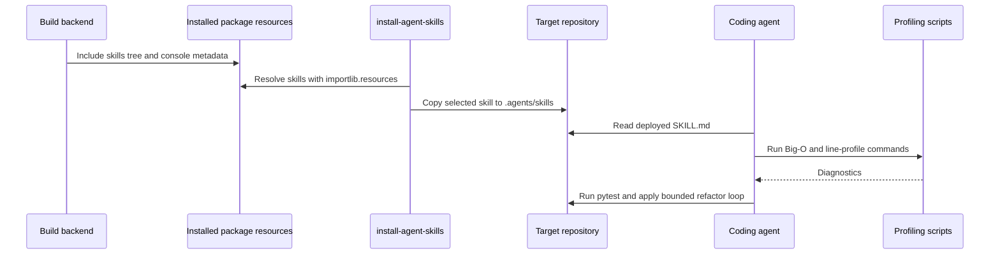

# Package architecture and runtime flows

`project-code-optimization` is a small `src/`-layout Python distribution whose public runtime is the `install-agent-skills` console script. The package owns a registry of bundled skills; the registry and setuptools package-data rule make the `skills/` tree available after installation. The installer copies that resource tree into a consuming repository, where an agent reads `SKILL.md` and invokes the two profiling scripts.

## Ownership and boundaries

- `src/project_code_optimization/__init__.py` owns version fallback and the `BUNDLED_SKILLS` registry.
- `src/project_code_optimization/cli.py` owns deployment policy, filesystem mutation, logging, and CLI parsing.
- `skills/code-optimizer/SKILL.md` owns the agent procedure; scripts own executable diagnostics and report template owns output structure.
- `pyproject.toml` owns the build metadata, dependency bounds, console entry point, and inclusion of non-Python skill files.
- `tests/` validates installer behavior and profiling behavior; the target repository's tests are a quality gate described by the skill, not executed by this package automatically.

Caption: Installed resources flow through the deployer before the consuming agent runs diagnostics.

## Deployment lifecycle

The default destination is `<cwd>/.agents/skills`; `--target` changes it. A selected skill must have `SKILL.md` before it is copied. Existing destinations are moved to a UTC timestamped backup unless `--force` is supplied. `--dry-run` reports intended actions and returns selected names without creating the target. See [the installer contract](../package/installer.md) and [packaging ownership](../package/registry-and-packaging.md).

## Change navigation

Change the registry or build rules in [registry and packaging](../package/registry-and-packaging.md); change deployment semantics in [installer](../package/installer.md); change agent behavior in [skill overview](../skills/code-optimizer/overview.md); change diagnostics in [Big-O](../skills/code-optimizer/big-o.md) or [line profiling](../skills/code-optimizer/line-profile.md).
