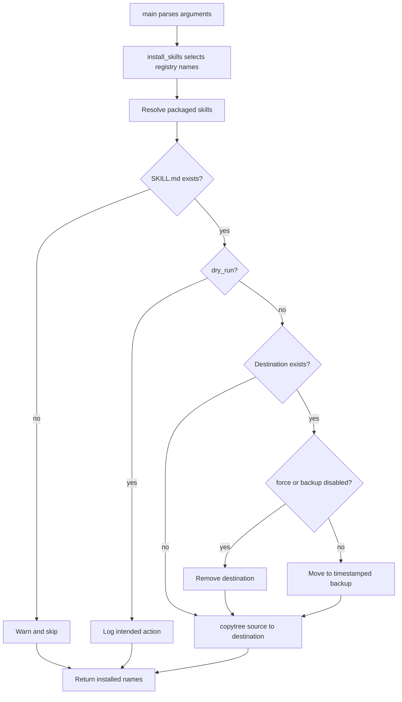

# Skill installer CLI

`src/project_code_optimization/cli.py` exposes `main(argv)` for the console entry point and `install_skills(...)` for programmatic use. The function returns the names successfully selected or installed; unknown names are logged and skipped.

## Execution and invariants

1. Resolve `target_dir`, defaulting to `<cwd>/.agents/skills`, and configure INFO or DEBUG logging.
2. Resolve package resources through `importlib.resources.files("project_code_optimization") / "skills"`.
3. Select all registry keys unless `skills` is supplied; an empty selection exits with status 1.
4. For each registry name, require `SKILL.md`; missing manifests are warned and skipped.
5. In dry-run mode, log create/replace/force-overwrite intent without touching the filesystem.
6. Otherwise, move an existing destination to `<name>.backup-<UTC timestamp>` when backup is enabled; `force` removes it instead and disables backup.
7. Copy the complete source directory with `shutil.copytree`; copy failures log an error and exit status 1.

Caption: The installer validates each selected resource before choosing dry-run, backup, or replacement behavior.

## CLI surface

`--target PATH`, repeatable `--skill NAME`, `--force`, `--dry-run`, `-v/--verbose`, and `--version` are parsed by `main`. The CLI passes `backup=not args.force`, so force replacement cannot create backups. The package does not validate arbitrary skill frontmatter beyond checking that `SKILL.md` exists; `tests/test_cli.py` separately checks bundled files contain `name:` and `description:`.

## Focused tests

`tests/test_cli.py` proves default and custom targets, complete copied layout, backup preservation, force replacement, dry-run non-mutation/reporting, subset selection, unknown-skill logging, manifest fields, and all CLI flags. When changing deployment ordering or failure behavior, run `pytest -q tests/test_cli.py`.

## Partial-failure boundary

Replacement is not transactional. After `shutil.move` creates a backup, or after force mode removes the old destination, a later `shutil.copytree` `OSError` logs `Failed to copy skill ...` and exits 1; the implementation does not restore the old destination or delete the backup. A future change must preserve or deliberately revise this observable partial-failure behavior. Add focused tests that force `copytree` to fail after backup and after force removal, alongside the existing backup, force, and dry-run tests.
