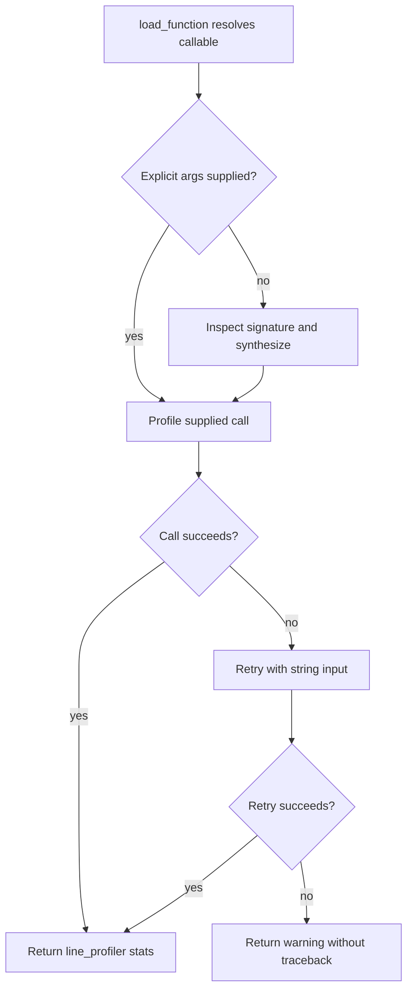

# Line profiling

`skills/code-optimizer/scripts/run_line_profile.py` exposes `load_function(file_path, func_name)`, `synthesize_arguments(func)`, `run_line_profile(func, args=None, kwargs=None)`, and `main(argv)`. It dynamically loads a target module, resolves a callable, instruments it with `line_profiler.LineProfiler`, executes one guarded call, and returns formatted statistics.

## Synthetic argument policy

`synthesize_arguments` inspects the signature. Annotated `int` receives `0`, `float` `0.0`, `bool` `False`, `str` a 200-character `x` string, `list` or `Iterable` a `list(range(1000))`, and `dict` `{"key": "value"}`; unannotated parameters and unsupported annotations receive `range(1000)`. Positional-only and positional-or-keyword values go into `args`; keyword-only values go into `kwargs`. `*args` receives a range and `**kwargs` receives the `_synthetic` key with an empty dict. Zero-argument functions receive no positional values. If `inspect.signature` raises `ValueError` or `TypeError` (built-in-like callables), it falls back to `(range(1000),), {}`. If synthesis itself raises in `run_line_profile`, the caller catches it and attempts `(), {}`.

`run_line_profile` uses supplied `args`/`kwargs` when present. If the first call raises, it retries with a 200-character string; if that also fails it returns exactly a block beginning `=== LINE PROFILER OUTPUT ===`, followed by `Warning: Synthetic test run failed: <exception>`, then `No profile data collected.`, rather than raising. Successful output starts with `=== LINE PROFILER OUTPUT ===` and then `LineProfiler.print_stats` output. If synthesis raises, `run_line_profile` substitutes empty arguments for the primary attempt, then follows the same fallback path.

The CLI accepts `--file`, `--func`, and optional `--call-args`. JSON arrays become positional arguments and objects become keyword arguments. A valid scalar or other non-list/non-dict JSON value is decoded but ignored, leaving empty positional and keyword arguments; it does not produce a JSON error. Malformed JSON prints `Error: Invalid JSON for --call-args: <decoder error>` to stderr and exits 1. Unresolved files/functions are likewise reported on stderr with exit status 1. Supplying `--call-args` bypasses automatic signature synthesis; omitted `--call-args` passes initialized empty tuples/dicts to `run_line_profile`, whose `args is not None` branch therefore also bypasses synthesis at the CLI boundary.

Caption: Invocation falls back from signature-derived or explicit arguments to a string call before graceful degradation.

## Focused tests

`TestLineProfiler` covers banners, columns, function names, zero-argument and multi-argument calls, and graceful failure. `TestSynthesizeArguments` checks executable values for one, zero, and typed multi-argument functions; loading tests cover missing files and functions. Focused validation for these seams is: monkeypatch `inspect.signature` to raise and assert the empty-argument attempt; use a function that rejects both synthesized and string inputs and assert the exact warning/no-data block; invoke `main` with scalar JSON and assert it reaches the empty-argument behavior; invoke malformed JSON and assert the `Error: Invalid JSON for --call-args:` stderr plus status 1. The checked-in `TestLineProfiler` and `TestSynthesizeArguments` suites cover the core boundary; run `pytest -q tests/test_profiling_scripts.py -k 'LineProfiler or SynthesizeArguments'`, then execute these four wrapper cases when validating CLI changes.
