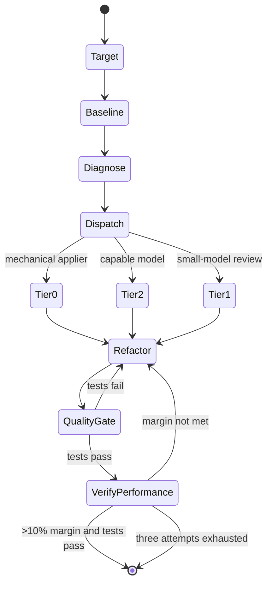

# Code optimizer skill

<!-- openwiki: broken internal link [../package/installer.md] file "../package/installer.md" does not exist. Fix the href or restore the target, then delete this comment. -->
`skills/code-optimizer/SKILL.md` is an Agent Skills manifest and operating procedure. Its frontmatter declares `name: code-optimizer`, `compatible_agents` (`claude-code`, `gemini-cli`, `cursor`, `codex-cli`), `allowed_tools` (`bash`, `read_file`, `write_file`), and `version: 1.0.0`. The [installer](../package/installer.md) deploys this directory unchanged to `.agents/skills/code-optimizer/`.

## Five-phase workflow

1. **Phase 0 — choosing a target.** Both profiling scripts accept `--target-type` (`function` default, `file`, `files`, `commit`, `repo`) controlling scope. `--max-targets` (default 30; 0 disables the count cap) bounds resolution; the per-target `--timeout` (default 120s) remains the guard. `--dry-run` lists resolved targets and exits before importing or calling anything. See [Big-O profiling](big-o.md) and [line profiling](line-profile.md) for the target-resolution contract and [pipeline](pipeline.md) for the baseline CSV path.

2. **Phase 1 — parallel baseline profiling.** Run [tier detection](tier-detection.md) first (every gate branches on it), then in parallel: [Big-O](big-o.md), [line profiling](line-profile.md), static AST + bytecode [detectors](detectors.md), [concurrency and memory gates](gates.md), and the target repo's `pytest` baseline. A free-threaded build prints a `RuntimeWarning` and returns `enhanced` (extra checks active, treat as experimental); otherwise `baseline`.

3. **Phase 2 — bottleneck identification.** Combine empirical complexity, line `Hits`, and allocation observations to identify the bottleneck.

<!-- openwiki: broken internal link [../package/auditing.md] file "../package/auditing.md" does not exist. Fix the href or restore the target, then delete this comment. -->
4. **Phase 3 — corrective optimization loop (max 3 attempts).** Refactor → run `pytest` (if tests fail, fix before re-profiling) → re-profile with a **>10% improvement margin** (`confirmation.decide_keep`) AND tests passing → exit; otherwise revert and try again. The local-integration [`@audit_performance`](../package/auditing.md) decorator and `track_memory` context manager enforce in-process budgets. See [resolvers](resolvers.md) for the `apply_and_verify` measure-apply-remeasure-keep loop.

5. **Phase 4 — final reporting.** Render using `templates/report_template.md` (full before/after) or `templates/baseline_report_template.md` (baseline-only, no "after" sections, findings most-severe-first). See [reporting](reporting.md) for the report contract and [pipeline](pipeline.md) for the CSV-baseline path (the numbers are the report).

6. **Phase 5 — tiered fix dispatch (from a baseline CSV).** `classify_findings.py` → `render_action_list.py` / `apply_and_verify.py`. Tier0 (mechanical, 9 tiers, deterministic appliers) → tier2 (algorithmic, capable model) → tier1 (small-model review). See [pipeline](pipeline.md) for the full dispatch and [resolvers](resolvers.md) for the tier0 appliers.

Caption: The skill dispatches findings to tier0/tier1/tier2 lanes and gates performance verification on correctness and a >10% improvement margin.

## Environment and scope

The scripts require `big-O` and `line-profiler` in the execution environment. `pytest` belongs to the target repository and is not a dependency of the skill package. Big-O's adapter binds multi-parameter functions to the single-list calling convention; line profiling synthesizes arguments or accepts explicit `--call-args`. `py-spy` and `memray` are optional documented integrations — the built-in path is `line_profiler` + `tracemalloc`, both already dependencies. The skill orchestrates tools but does not modify source automatically — the agent performs refactoring and owns the final decision.

Use [Big-O profiling](big-o.md) and [line profiling](line-profile.md) for implementation contracts; [tier detection](tier-detection.md) for the tier system; [detectors](detectors.md) and [resolvers](resolvers.md) for the tier0 lane; [pipeline](pipeline.md) for the baseline-classify-render-regression flow; [gates](gates.md) for concurrency and memory; [reporting](reporting.md) for the durable output schema.
