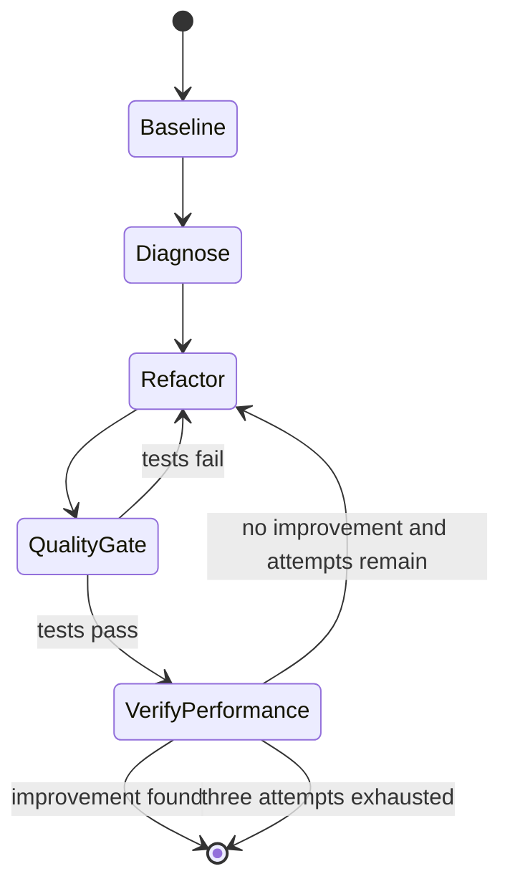

# Code optimizer skill

`skills/code-optimizer/SKILL.md` is an Agent Skills manifest and operating procedure. Its frontmatter declares `name: code-optimizer`, compatible agents (`claude-code`, `gemini-cli`, `cursor`, `codex-cli`), and allowed tools. The installer deploys this directory unchanged to `.agents/skills/code-optimizer/`.

## Four-phase workflow

The agent first runs Big-O estimation, line profiling, and the target repository's `pytest` baseline in parallel. It then combines empirical complexity, line `Hits`, and allocation observations to identify a bottleneck. The corrective loop is capped at three attempts: refactor, run `pytest`, and only after tests pass rerun both performance tools. A non-improving or regressing change is reverted or replaced. The final result is rendered using [the report template](reporting.md).

Caption: The skill gates performance verification on correctness and bounds optimization at three attempts.

## Environment and scope

The scripts require `big-O` and `line-profiler` in the execution environment. `pytest` belongs to the target repository and is not installed by the skill package. Big-O expects a one-positional-argument callable; line profiling can synthesize arguments for several signatures or accept explicit JSON call arguments. The skill orchestrates tools but does not modify source automatically—the agent performs refactoring and owns the final decision.

Use [Big-O profiling](big-o.md) and [line profiling](line-profile.md) for implementation contracts; use [reporting](reporting.md) for the durable output schema.
