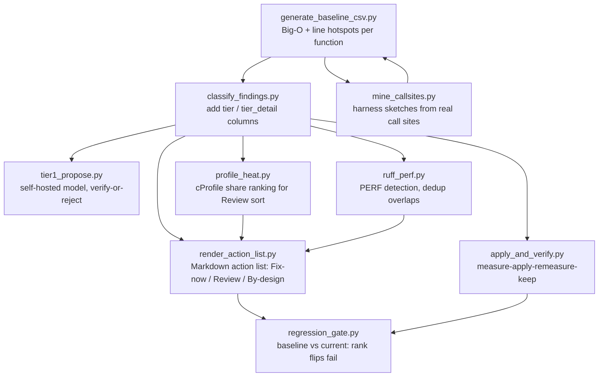

# Baseline, classify, render, and regression pipeline

The deterministic execution pipeline turns profiling output into actionable tiers without LLM tokens. It flows `generate_baseline_csv.py` → `classify_findings.py` → (`render_action_list.py` | `apply_and_verify.py`) → `regression_gate.py`, with `provenance.py` headers, `confirmation.py` hysteresis, `profile_heat.py` measured heat, `mine_callsites.py` harness provenance, `tier1_propose.py` self-hosted proposals, and `ruff_perf.py` upstream-lint dedup as side lanes.

Caption: The deterministic pipeline routes findings to tiers, fixers, and CI gates without tokens.

## generate_baseline_csv.py

`scripts/generate_baseline_csv.py` calls the same underlying profiling functions directly (no subprocess, no text parsing) and writes one CSV row per resolved `(file, function)` target, pre-sorted most-to-least severe using `severity.py`'s ranking. It accepts the same `--target-type`/`--file`/`--files`/`--commit`/`--repo`/`--max-targets`/`--min-n`/`--max-n`/`--n-measures`/`--n-timings`/`--n-repeats`/`--timeout` flags as the two profiling scripts. `FIELDNAMES` are frozen: `rank, severity, file, function, empirical_big_o, complexity_rank, big_o_error, total_hits, total_hotspot_time_us, top_hotspot_pct_time, top_hotspot_line, top_hotspot_source, line_profile_error`. An optional `.inputs.json` sidecar records how each row's Big-O input was produced (`provenance`, `shape_desc`, `min_n`/`max_n`/`n_measures`, `residuals`).

## classify_findings.py

`scripts/classify_findings.py` consumes the baseline CSV and adds `tier` / `tier_detail` columns by pure static/numeric analysis — no execution, no LLM. `_TIER0_PRIORITY` orders the tier0 checks cheapest-and-most-certain first (`regex_hoist` > `re_call` > `perf402` > `perf401` > `perf403` > `str_join` > `sum_reduce` > `set_build` > `invariant_hoist`); tier0 is checked before tier2 because a mechanical fix beats a model rewrite even for a row that also shows high complexity. Tiers: `tier0_*` (mechanical, detected by [detectors](detectors.md) static analysis alone — applies even to rows whose profiling failed), `tier2_algorithmic` (`complexity_rank >= 4`), `tier1_review` (profiling succeeded, no complexity problem, no mechanical pattern), `not_actionable`. One file is analyzed once and its tier0 plan is shared across every row for that file (P8). `OUTPUT_FIELDNAMES_SUFFIX = ["tier", "tier_detail"]` is appended, order unchanged.

## render_action_list.py

`scripts/render_action_list.py` consumes the classified CSV (plus the optional `.inputs.json` sidecar) and emits the outsider-readable Markdown summary: what to fix now, what to review, and what is by design — instead of a 228-row CSV that is mostly error rows. `TIER0_PRIORITY` and `TIER0_RESOLVER` mirror `classify_findings`'s tuples (kept identical; `test_pipeline.py` pins this). Big-O honesty rule: a "Constant" fit on synthetic micro-input proves the call ran, not the complexity — such rows render as unmeasured, never as findings. `--heat` ranks `tier1_review` rows by cumulative cProfile share first (measured burn beats static edges); `--reachability` ranks by caller count; `--ruff` adds the ruff-unique PERF lane.

## profile_heat.py — measured heat lane

`scripts/profile_heat.py` ingests `cProfile`/`pstats` dumps (stdlib only) and ranks functions by cumulative-time share. Static reachability guesses value ("called" vs "hot"); a cProfile dump records what actually burned. Unprofiled rows sort last. Repeat `--profile` to coalesce several dumps; record without `strip_dirs`, resolved from the repo root, so file keys join.

## mine_callsites.py — harness provenance

`scripts/mine_callsites.py` finds how a target function is really called across a repo (arg sources included) and emits a harness sketch: a starting-point module the human reviews for realism, then profiles with the normal pipeline. Approved harnesses carry the `__big_o_provenance__` marker — the only thing that promotes a row from "synthetic" to "harness" provenance. Read-only toward the target (AST only).

## tier1_propose.py — self-hosted model lane

`scripts/tier1_propose.py` sends each `tier1_review` row to a local Ollama server (`$OLLAMA_HOST`, default `http://localhost:11434`; `--model` default `qwen2.5-coder:14b`) and verifies every returned diff on a scratch copy — parse, apply, byte-compile, measure past the keep margin — reporting `VERIFIED` or `REJECTED` per row without writing the original unless `--apply` is passed. No cloud, no tokens (stdlib `urllib`). Model output carries no equivalence proof; a measured gain on synthetic inputs is evidence, not certainty.

## ruff_perf.py — upstream PERF dedup

`scripts/ruff_perf.py` runs `ruff check --select PERF` on target files and normalizes the JSON hits into plan dataclasses. `OVERLAPPING_CODES = ("PERF401", "PERF402", "PERF403")` — hits at locations the tier0 [detectors](detectors.md) already cover are deduped in our favor (we own the applier plus the measurement); ruff-unique rules (`PERF101`/`102`/`203`) are reported as their own lane. Detection only — this script never writes target files.

## confirmation.py — statistical hysteresis (P7)

`scripts/confirmation.py` keeps noisy empirical signals from driving decisions. `tier2_confirmed(rank, confirmations=1)`: ranks 5+ (cubic and worse) escalate immediately; rank 4 (quadratic — the classic Linear↔Quadratic flap zone) escalates only with `REQUIRED_CONFIRMATIONS = 2` independent agreeing measurements. `decide_keep(before_us, after_us)` requires relative improvement strictly greater than `KEEP_MARGIN = 0.10` (10%) so a 2% "improvement" (noise wearing a costume) never keeps a rewrite. A lone Quadratic fit is as likely to be a curve-fit flap as a finding.

## provenance.py — artifact headers and schema versioning (P6)

`scripts/provenance.py` stamps every emitted CSV with `# key=value` preamble lines above the header: `tool_version`, `schema_version` (integer, bumped on any column or semantic change; `SCHEMA_VERSION = 1`), `python` (full version + tier), `commit` (best-effort), `created_utc`. `check_compatible` asserts the schema before parsing anything — unknown or mismatched versions fail closed (loud `ProvenanceError`, never silent misread) and refuses cross-schema and cross-tier baseline comparisons for before/after diffing. The preamble uses `#` comment lines rather than extra CSV columns so the frozen `FIELDNAMES` contract is untouched; plain `csv.DictReader` users must strip leading `#` lines first (`split_preamble`).

## regression_gate.py — two-level CI gate

`scripts/regression_gate.py` compares two classified CSVs (baseline vs current): hard failure (exit 1) when a row's complexity rank got worse or a `(file, function)` row is newly tier0/tier2; advisory wall-clock hotspot movement beyond `--margin` (default 0.10, same as `KEEP_MARGIN`; harden with `--strict-time` only on a pinned runner); harness error (exit 2) on unreadable input or a missing tier column. Rank improvements and resolved findings are reported, never failures.

## CI templates

`skills/code-optimizer/templates/` ships `pre_commit_example.sh` (desktop hook, fail open: tool errors warn and exit 0; copy to `.git/hooks/` manually — the installer never writes hooks), `ci_static_example.yml` (ruff PERF blocking gate plus AST audits as advisory log; seconds per PR, no target-code execution), `ci_gates_example.yml` (execution profilers + memory/concurrency gates), and `ci_regression_example.yml` (the regression gate). Gate exit codes: 0 pass/warn/skipped, 1 finding-fail, 2 harness error. `skipped` is never a failure. For legacy codebases, diff finding `fingerprint` sets (`--json` outputs carry them) and fail only on introduced fingerprints.

## Focused tests

- `tests/test_generate_baseline_csv.py`, `tests/test_classify_findings.py`, `tests/test_render_action_list.py`, `tests/test_pipeline.py` — CSV field order, tier routing, priority-tuple identity, sidecar honesty.
- `tests/test_profile_heat.py`, `tests/test_reachability.py` — heat ranking, caller counts, entry reachability.
- `tests/test_provenance.py` — preamble parsing, schema mismatch fail-closed, cross-tier/cross-schema comparison refusal.
- `tests/test_confirmation.py` — keep margin, tier2 confirmation count, flap-zone hysteresis.
- `tests/test_regression_gate.py` — rank flip failure, new-tier0/tier2 failure, advisory wall-time, exit codes.
- `tests/test_ruff_perf.py` — overlap dedup, ruff-unique lane, missing-ruff error.
- `tests/test_call_compat.py` — multi-arg adapter binding, click-command by-design, zero-arg fast-fail.
- `tests/test_timeouts.py` — per-target budget breach → error row, `None`/non-positive runs inline.
- `tests/test_severity.py`, `tests/test_tier1_propose.py`, `tests/test_dry_run.py`, `tests/test_confirmation.py`.

Run `pytest -q tests/test_generate_baseline_csv.py tests/test_classify_findings.py tests/test_render_action_list.py tests/test_pipeline.py tests/test_profile_heat.py tests/test_reachability.py tests/test_provenance.py tests/test_confirmation.py tests/test_regression_gate.py tests/test_ruff_perf.py tests/test_call_compat.py tests/test_timeouts.py tests/test_severity.py tests/test_tier1_propose.py`.

## Change navigation

Adding a tier0 tier requires updating `_TIER0_PRIORITY` in both `classify_findings.py` and `render_action_list.py` (kept identical; `test_pipeline.py` pins this), a [detector](detectors.md), a [resolver](resolvers.md), and the `apply_and_verify` dispatch tables. Bump `provenance.SCHEMA_VERSION` on any CSV column or semantic change — consumers fail closed on mismatch. Keep `KEEP_MARGIN` (0.10) and `regression_gate.DEFAULT_MARGIN` (0.10) in sync. The heat lane is optional; keep reachability as the fallback when no profile exists.
