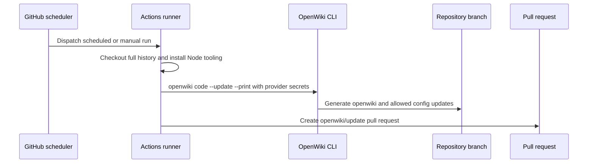

# OpenWiki update operations

`.github/workflows/openwiki-update.yml` runs the repository documentation refresh either manually (`workflow_dispatch`) or daily at `0 8 * * *`. It grants `contents: write` and `pull-requests: write` because the final step creates a branch and pull request containing generated changes.

## Runtime contract

The workflow runs on `ubuntu-latest`, checks out the repository with pinned `actions/checkout` and `fetch-depth: 0`, and installs Node.js 22 with pinned `actions/setup-node`. Full history is required because `openwiki code --update` compares against the commit it last documented. It globally installs `openwiki@0.3.1`, `mermaid@11.16.0`, and `jsdom@29.1.1`; the latter two enable diagram validation.

The OpenWiki step uses the `openrouter` provider, model `z-ai/glm-5.2`, and repository secrets `OPENROUTER_API_KEY` and `OPENWIKI_LANGSMITH_API_KEY`. Optional LangSmith tracing uses `LANGSMITH_API_KEY`, `LANGCHAIN_PROJECT=openwiki`, and `LANGCHAIN_TRACING_V2=true`. Secrets are configuration inputs only and must never be copied into wiki content.

Caption: The workflow regenerates documentation on a full-history runner and proposes the result instead of pushing directly to the default branch.

## Generated paths and change surface

The pull-request action adds `openwiki`, `AGENTS.md`, `CLAUDE.md`, and `.github/workflows/openwiki-update.yml` on branch `openwiki/update`, with commit/title `docs: update OpenWiki`. A failed checkout, missing provider secret, model/provider error, or Mermaid validation issue prevents a trustworthy update. Changes to workflow permissions, pinned action versions, generated paths, provider/model variables, or secret names require operational review.
